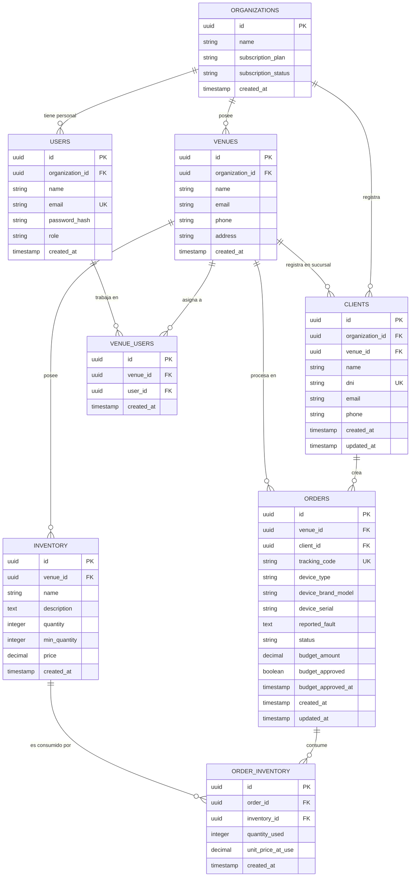

# Modelo Entidad-Relación: RepairIT (Multi-Sucursal & Normalizado)

Este diagrama representa el modelo de datos de la base de datos de **RepairIT**, estructurado de forma normalizada (3NF) para evitar redundancias de clientes y permitir la gestión multi-sucursal y multi-inquilino.

